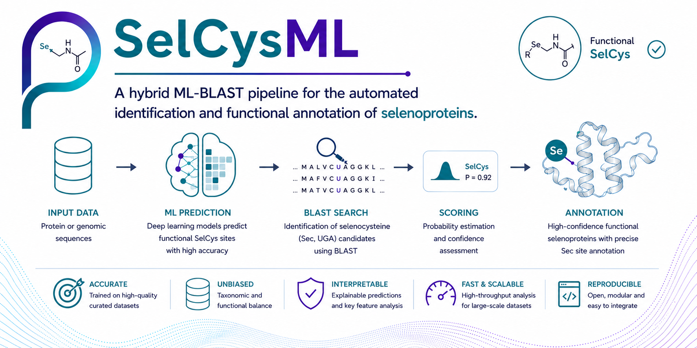

# *SelCysML:* A hybrid ML-BLAST pipeline for the automated identification and functional annotation of selenoproteins.

**Background:** Selenoproteins, characterized by the incorporation of selenocysteine (Sec) via UGA codon recoding, play vital roles in redox homeostasis and enzymatic catalysis [1]. Despite their biological importance, the computational identification of selenoproteins remains challenging due to the inherent complexity of identifying Sec-containing sequences among standard proteins [2]. Existing tools often function as "black boxes" with limited interpretability or lack integrated functional validation, leading to high false-positive rates or ambiguous annotations. 

**Results:** We present SelCys-Predictor, an accessible and highly accurate computational pipeline that integrates an ensemble of machine learning (ML) models with a parallel functional validation module using BLAST. By utilizing curated physicochemical descriptors—Amino Acid Composition (AAC) and Composition, Transition, Distribution (CTDC)—the model achieves a robust performance, with an AUC-ROC of 0.968 and a Matthews Correlation Coefficient (MCC) of 0.787 [3]. SelCys-Predictor not only classifies protein sequences but also provides functional evidence through sequence similarity, effectively bridging the gap between automated prediction and experimental biological insight. 

**Conclusion:** SelCys-Predictor provides a user-friendly, interpretable, and high-precision solution for the identification of selenoproteins in genomic and proteomic datasets, serving as a reliable tool for both bioinformaticians and experimental biologists.
