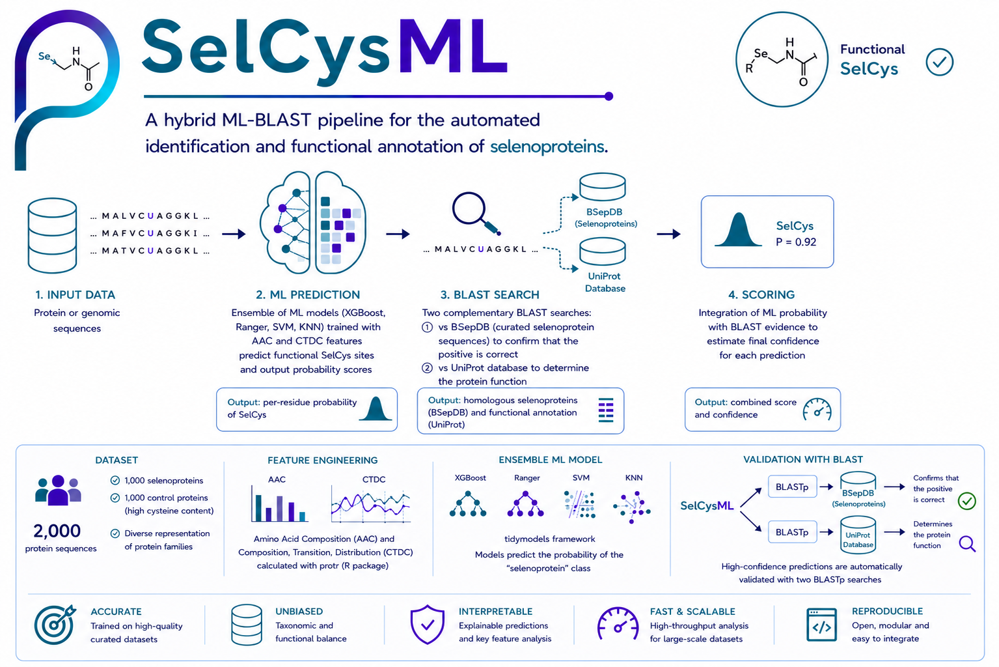

# *SelCysML:* A hybrid ML-BLAST pipeline for the automated identification and functional annotation of selenoproteins.

**Background:** Selenoproteins, characterized by the incorporation of selenocysteine (Sec) via UGA codon recoding, play vital roles in redox homeostasis and enzymatic catalysis [1]. Despite their biological importance, the computational identification of selenoproteins remains challenging due to the inherent complexity of identifying Sec-containing sequences among standard proteins [2]. Existing tools often function as "black boxes" with limited interpretability or lack integrated functional validation, leading to high false-positive rates or ambiguous annotations. 

**Results:** We present SelCys-Predictor, an accessible and highly accurate computational pipeline that integrates an ensemble of machine learning (ML) models with a parallel functional validation module using BLAST. By utilizing curated physicochemical descriptors—Amino Acid Composition (AAC) and Composition, Transition, Distribution (CTDC)—the model achieves a robust performance, with an AUC-ROC of 0.968 and a Matthews Correlation Coefficient (MCC) of 0.787 [3]. SelCys-Predictor not only classifies protein sequences but also provides functional evidence through sequence similarity, effectively bridging the gap between automated prediction and experimental biological insight. 

**Conclusion:** SelCys-Predictor provides a user-friendly, interpretable, and high-precision solution for the identification of selenoproteins in genomic and proteomic datasets, serving as a reliable tool for both bioinformaticians and experimental biologists.

## **Installation & Setup**

Clone the Repository: 

```bash
git clone https://github.com/usuario/SelCYs.git
```

**Download the Model:** Due to its size (700MB), the trained ensemble bundle is hosted on Zenodo.
	
Download: https://zenodo.org/uploads/record/XXXXXXXXXXXXX
	
**Placement:** Place the Ensemble_Bundle.rds file inside the models/ folder.

**Install dependencies**

SelCysML requires R (version 4.0 or higher) and several packages for machine learning and sequence processing. Run the following commands in your R console to install the necessary dependencies:

```R
# 1. Install CRAN dependencies
dependencies_cran <- c("shiny", "shinythemes", "tidymodels", "themis", "tidyverse", 
                       "Matrix", "svglite", "DT", "Peptides", "workflowsets", 
                       "rsample", "yardstick")

install.packages(dependencies_cran, dependencies = TRUE)

# 2. Install Bioconductor dependencies (for sequence analysis)
if (!require("BiocManager", quietly = TRUE)) install.packages("BiocManager")
BiocManager::install(c("protr", "Biostrings"))

# 3. Install specific engine dependencies (optional, if missing)
install.packages(c("xgboost", "ranger", "kernlab", "kknn"))

Make sure that BLAST database and executable are in the right path, modify accordingly to your BLAST installation.

BLAST_DB <- "/Path_to_database/BLASTdb/uniprot_db" 
BLAST_PATH <- "/Path_to_BLAST_executable/ncbi-blast-2.17.0+/bin/blastp.exe"
```

**Running the App:**

To launch the SelCysML interface:

    Clone or download this repository.

    Open the project folder in RStudio.

    Open app.R and click "Run App" (located in the top-right of the editor window), or execute the following command in the console:

or

```R
shiny::runApp()
```

    Note: Ensure your machine has enough memory allocated, especially when processing large genomic datasets. The application is configured to handle high-memory requests for FASTA uploads (up to 800 MB).

    System Requirements: "Tested on Linux, macOS, and Windows with R 4.x".

**Ensure BLAST+ is installed and accessible in your system's PATH** to enable the functional validation module.

**Download model and BLASTdb files here:**

``` https://zenodo.org/uploads/20625234 ```

